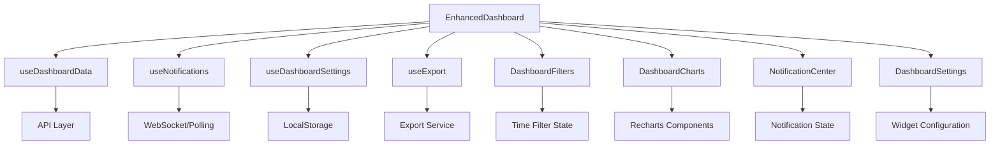

# Design Document

## Overview

Este documento describe el diseño técnico para implementar mejoras significativas en el dashboard de ConstructPro. Las mejoras incluyen gráficos interactivos con Recharts, filtros temporales avanzados, sistema de notificaciones en tiempo real, personalización por usuario y capacidades de exportación. El diseño mantiene la arquitectura existente mientras agrega nuevas funcionalidades de manera modular y escalable.

## Architecture

### Component Architecture

```
src/
├── components/
│   └── dashboard/
│       ├── DashboardCharts.tsx          # Gráficos interactivos con Recharts
│       ├── DashboardFilters.tsx         # Filtros temporales y controles
│       ├── NotificationCenter.tsx       # Centro de notificaciones
│       ├── DashboardSettings.tsx        # Configuración personalizable
│       └── ExportModal.tsx              # Modal de exportación
├── hooks/
│   ├── useDashboardData.ts             # Hook para datos del dashboard
│   ├── useNotifications.ts             # Hook para notificaciones
│   ├── useDashboardSettings.ts         # Hook para configuración
│   └── useExport.ts                    # Hook para exportación
├── pages/
│   └── EnhancedDashboard.tsx           # Dashboard mejorado principal
├── lib/
│   ├── chartUtils.ts                   # Utilidades para gráficos
│   ├── exportUtils.ts                  # Utilidades de exportación
│   └── notificationUtils.ts            # Utilidades de notificaciones
└── types/
    ├── dashboard.ts                    # Tipos del dashboard
    ├── notifications.ts                # Tipos de notificaciones
    └── charts.ts                       # Tipos de gráficos
```

### Data Flow Architecture



## Components and Interfaces

### 1. DashboardCharts Component

**Purpose:** Renderizar gráficos interactivos usando Recharts

**Props Interface:**
```typescript
interface DashboardChartsProps {
  budgetData: BudgetDataPoint[]
  projectProgressData: ProjectProgressData[]
  teamPerformanceData: TeamPerformanceData[]
  expensesByCategory: ExpenseCategory[]
  timeFilter: string
  onChartInteraction?: (data: any) => void
}
```

**Key Features:**
- Gráficos de área para utilización de presupuesto
- Gráficos de barras para progreso de proyectos
- Gráficos de líneas para rendimiento del equipo
- Gráficos de pastel para gastos por categoría
- Tooltips interactivos con formateo de moneda
- Responsividad completa

### 2. DashboardFilters Component

**Purpose:** Proporcionar controles de filtrado temporal y acciones rápidas

**Props Interface:**
```typescript
interface DashboardFiltersProps {
  timeFilter: string
  onTimeFilterChange: (filter: string) => void
  dateRange: { start: string; end: string }
  onDateRangeChange: (range: { start: string; end: string }) => void
  onExport: () => void
  onToggleNotifications: () => void
  onOpenSettings: () => void
  notificationsEnabled: boolean
}
```

**Key Features:**
- Botones de filtro temporal (semana, mes, trimestre, año, personalizado)
- Selectores de fecha para rango personalizado
- Botones de acción (exportar, notificaciones, configuración)
- Estado visual para filtros activos

### 3. NotificationCenter Component

**Purpose:** Gestionar y mostrar notificaciones en tiempo real

**Props Interface:**
```typescript
interface NotificationCenterProps {
  isOpen: boolean
  onClose: () => void
  notifications: Notification[]
  onMarkAsRead: (id: string) => void
  onMarkAllAsRead: () => void
}

interface Notification {
  id: string
  type: 'info' | 'warning' | 'success' | 'error'
  title: string
  message: string
  timestamp: Date
  read: boolean
  actionUrl?: string
}
```

**Key Features:**
- Panel deslizable desde la derecha
- Filtros por estado (todas/no leídas)
- Iconos diferenciados por tipo de notificación
- Timestamps relativos (hace 5m, hace 2h)
- Acciones de marcar como leída

### 4. DashboardSettings Component

**Purpose:** Permitir personalización del dashboard por usuario

**Props Interface:**
```typescript
interface DashboardSettingsProps {
  isOpen: boolean
  onClose: () => void
  widgets: DashboardWidget[]
  onSaveSettings: (widgets: DashboardWidget[]) => void
  onResetToDefault: () => void
}

interface DashboardWidget {
  id: string
  name: string
  description: string
  enabled: boolean
  position: number
}
```

**Key Features:**
- Lista de widgets disponibles con toggle
- Reordenamiento drag-and-drop o botones arriba/abajo
- Vista previa de configuración
- Botones de guardar/cancelar/restaurar

## Data Models

### Dashboard Data Structure

```typescript
interface DashboardData {
  stats: {
    activeProjects: number
    totalBudget: number
    teamMembers: number
    pendingTasks: number
    availableTools: number
    budgetUtilization: number
    projectsGrowth: number
    budgetGrowth: number
    teamGrowth: number
    tasksGrowth: number
  }
  budgetData: BudgetDataPoint[]
  projectProgressData: ProjectProgressData[]
  teamPerformanceData: TeamPerformanceData[]
  expensesByCategory: ExpenseCategory[]
  recentProjects: Project[]
  upcomingDeadlines: Deadline[]
}

interface BudgetDataPoint {
  period: string
  budgeted: number
  spent: number
}

interface ProjectProgressData {
  name: string
  progress: number
  status: 'on-track' | 'delayed' | 'completed'
}

interface TeamPerformanceData {
  period: string
  performance: number
  attendance: number
}

interface ExpenseCategory {
  name: string
  value: number
  color?: string
}
```

### Notification Data Structure

```typescript
interface NotificationState {
  notifications: Notification[]
  unreadCount: number
  isOpen: boolean
  filters: {
    type?: NotificationType
    read?: boolean
  }
}

type NotificationType = 'info' | 'warning' | 'success' | 'error'
```

### Settings Data Structure

```typescript
interface DashboardSettings {
  widgets: DashboardWidget[]
  preferences: {
    defaultTimeFilter: string
    autoRefresh: boolean
    refreshInterval: number
    notificationsEnabled: boolean
  }
  layout: {
    gridColumns: number
    compactMode: boolean
  }
}
```

## Error Handling

### Chart Rendering Errors

```typescript
// Error boundary para gráficos
class ChartErrorBoundary extends React.Component {
  componentDidCatch(error: Error, errorInfo: React.ErrorInfo) {
    console.error('Chart rendering error:', error, errorInfo)
    // Mostrar gráfico de fallback o mensaje de error
  }
}
```

### Data Loading Errors

```typescript
// Estados de error en hooks
interface DataState<T> {
  data: T | null
  loading: boolean
  error: string | null
}

// Retry logic para APIs
const useRetryableAPI = (apiCall: () => Promise<any>, maxRetries = 3) => {
  // Implementar lógica de reintentos con backoff exponencial
}
```

### Export Errors

```typescript
// Manejo de errores de exportación
interface ExportError {
  type: 'network' | 'format' | 'size' | 'permission'
  message: string
  retryable: boolean
}
```

## Testing Strategy

### Unit Testing

```typescript
// Pruebas para componentes de gráficos
describe('DashboardCharts', () => {
  it('should render all chart types correctly', () => {})
  it('should handle empty data gracefully', () => {})
  it('should format currency values properly', () => {})
  it('should respond to time filter changes', () => {})
})

// Pruebas para hooks
describe('useDashboardData', () => {
  it('should fetch data on mount', () => {})
  it('should refetch when time filter changes', () => {})
  it('should handle API errors', () => {})
})
```

### Integration Testing

```typescript
// Pruebas de integración para flujos completos
describe('Dashboard Integration', () => {
  it('should update all charts when time filter changes', () => {})
  it('should persist settings across sessions', () => {})
  it('should export data in correct format', () => {})
})
```

### Performance Testing

```typescript
// Pruebas de rendimiento para gráficos grandes
describe('Chart Performance', () => {
  it('should render 1000+ data points smoothly', () => {})
  it('should update charts within 100ms', () => {})
  it('should not cause memory leaks', () => {})
})
```

## Performance Considerations

### Chart Optimization

1. **Data Virtualization:** Para datasets grandes, implementar virtualización
2. **Memoization:** Usar React.memo para componentes de gráficos
3. **Lazy Loading:** Cargar gráficos solo cuando son visibles
4. **Debouncing:** Debounce de filtros para evitar renders excesivos

### Memory Management

1. **Cleanup:** Limpiar listeners y timers en useEffect cleanup
2. **Data Caching:** Implementar cache inteligente para datos de gráficos
3. **Image Optimization:** Optimizar assets de iconos y gráficos

### Network Optimization

1. **Data Aggregation:** Agregar datos en el backend cuando sea posible
2. **Incremental Updates:** Solo actualizar datos que han cambiado
3. **Compression:** Usar compresión gzip para respuestas de API

## Security Considerations

### Data Export Security

1. **Permission Validation:** Verificar permisos antes de exportar
2. **Data Sanitization:** Sanitizar datos antes de exportar
3. **Rate Limiting:** Limitar frecuencia de exportaciones

### Notification Security

1. **XSS Prevention:** Sanitizar contenido de notificaciones
2. **Authentication:** Verificar autenticación para notificaciones
3. **Content Validation:** Validar estructura de notificaciones

### Settings Security

1. **Input Validation:** Validar configuraciones del usuario
2. **Storage Security:** Encriptar configuraciones sensibles
3. **Access Control:** Controlar acceso a configuraciones avanzadas

## Accessibility

### Chart Accessibility

1. **Alt Text:** Proporcionar descripciones textuales de gráficos
2. **Keyboard Navigation:** Permitir navegación por teclado
3. **Screen Reader Support:** Implementar ARIA labels apropiados
4. **Color Contrast:** Asegurar contraste adecuado en gráficos

### Notification Accessibility

1. **Screen Reader Announcements:** Anunciar nuevas notificaciones
2. **Focus Management:** Gestionar foco al abrir panel de notificaciones
3. **Keyboard Shortcuts:** Implementar atajos de teclado

### Settings Accessibility

1. **Form Labels:** Etiquetas claras para todos los controles
2. **Error Messages:** Mensajes de error descriptivos
3. **Progress Indicators:** Indicadores de progreso para acciones largas

## Internationalization

### Text Localization

```typescript
// Estructura de traducciones
interface DashboardTranslations {
  filters: {
    week: string
    month: string
    quarter: string
    year: string
    custom: string
  }
  charts: {
    budgetUtilization: string
    projectProgress: string
    teamPerformance: string
    expensesByCategory: string
  }
  notifications: {
    markAllAsRead: string
    noNotifications: string
    newNotification: string
  }
  export: {
    exportData: string
    selectFormat: string
    downloading: string
  }
}
```

### Number and Date Formatting

```typescript
// Formateo localizado
const formatCurrency = (value: number, locale: string) => {
  return new Intl.NumberFormat(locale, {
    style: 'currency',
    currency: 'EUR' // o detectar automáticamente
  }).format(value)
}

const formatDate = (date: Date, locale: string) => {
  return new Intl.DateTimeFormat(locale, {
    year: 'numeric',
    month: 'short',
    day: 'numeric'
  }).format(date)
}
```