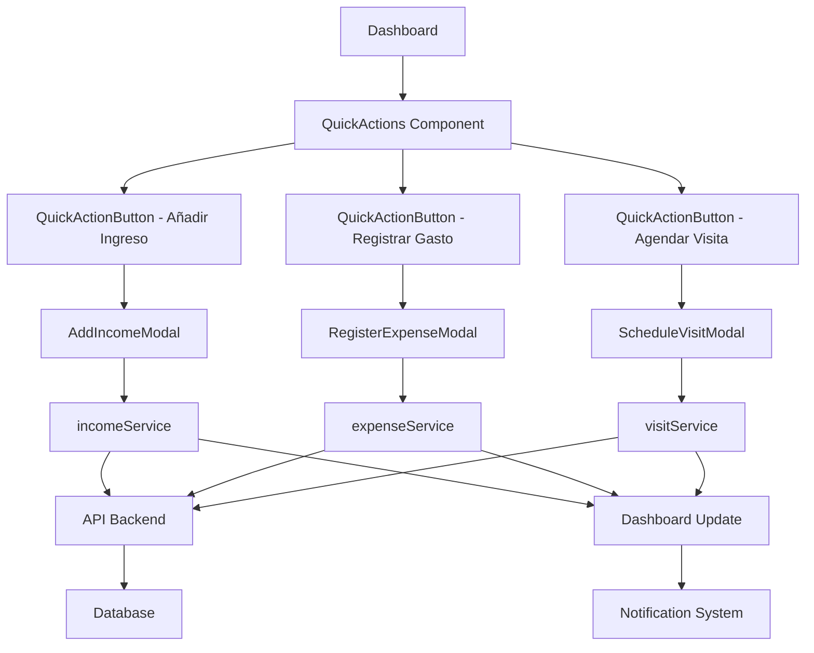

# Documento de Diseño

## Resumen

Este documento describe el diseño técnico para la implementación de la sección de Acciones Rápidas en el dashboard de ConstructPro. La funcionalidad proporcionará acceso inmediato a las tres operaciones más críticas del sistema: añadir ingresos, registrar gastos y agendar visitas. El diseño se enfoca en la usabilidad, accesibilidad y la integración fluida con los servicios existentes del sistema.

## Arquitectura

### Componentes Principales

```
src/
├── components/
│   └── dashboard/
│       ├── QuickActions.tsx (Componente principal)
│       ├── modals/
│       │   ├── AddIncomeModal.tsx
│       │   ├── RegisterExpenseModal.tsx
│       │   └── ScheduleVisitModal.tsx
│       └── QuickActionButton.tsx (Componente reutilizable)
├── services/
│   ├── incomeService.ts (Nuevo)
│   ├── expenseService.ts (Existente - extender)
│   └── visitService.ts (Nuevo)
├── types/
│   ├── income.ts (Nuevo)
│   └── visit.ts (Nuevo)
└── hooks/
    └── useQuickActions.ts (Nuevo)
```

### Flujo de Datos



## Componentes y Interfaces

### 1. QuickActions Component

**Ubicación:** `src/components/dashboard/QuickActions.tsx`

**Responsabilidades:**
- Renderizar los tres botones de acción rápida
- Gestionar el estado de apertura/cierre de modales
- Coordinar las notificaciones de éxito/error
- Adaptar el diseño según el tamaño de pantalla

**Props:**
```typescript
interface QuickActionsProps {
  onActionComplete?: (action: 'income' | 'expense' | 'visit') => void
  className?: string
}
```

**Estado Interno:**
```typescript
interface QuickActionsState {
  activeModal: 'income' | 'expense' | 'visit' | null
  isLoading: boolean
}
```

### 2. QuickActionButton Component

**Ubicación:** `src/components/dashboard/QuickActionButton.tsx`

**Responsabilidades:**
- Renderizar un botón de acción individual
- Aplicar estilos según el tipo de acción
- Manejar estados de hover y focus
- Proporcionar accesibilidad completa

**Props:**
```typescript
interface QuickActionButtonProps {
  label: string
  icon: React.ReactNode
  color: 'blue' | 'red' | 'purple'
  onClick: () => void
  disabled?: boolean
  ariaLabel?: string
}
```

### 3. AddIncomeModal Component

**Ubicación:** `src/components/dashboard/modals/AddIncomeModal.tsx`

**Responsabilidades:**
- Mostrar formulario para añadir ingreso
- Validar datos del formulario
- Llamar al servicio de ingresos
- Gestionar estados de carga y error

**Props:**
```typescript
interface AddIncomeModalProps {
  isOpen: boolean
  onClose: () => void
  onSuccess: (income: Income) => void
}
```

**Campos del Formulario:**
- Proyecto (selector con búsqueda)
- Monto (input numérico con formato de moneda)
- Fecha (date picker)
- Descripción (textarea)
- Método de pago (selector opcional)
- Referencia (input texto opcional)

### 4. RegisterExpenseModal Component

**Ubicación:** `src/components/dashboard/modals/RegisterExpenseModal.tsx`

**Responsabilidades:**
- Mostrar formulario para registrar gasto
- Validar clasificación obligatoria (proyecto, código de costo, proveedor)
- Llamar al servicio de gastos existente
- Gestionar estados de carga y error

**Props:**
```typescript
interface RegisterExpenseModalProps {
  isOpen: boolean
  onClose: () => void
  onSuccess: (expense: Expense) => void
}
```

**Campos del Formulario:**
- Proyecto (selector con búsqueda) *
- Categoría de gasto (selector) *
- Código de costo (selector dependiente de categoría) *
- Monto (input numérico) *
- Fecha (date picker) *
- Proveedor (selector con búsqueda o creación rápida) *
- Descripción (textarea) *
- Número de factura (input texto)
- Adjuntar archivo (file upload)

\* Campos obligatorios

### 5. ScheduleVisitModal Component

**Ubicación:** `src/components/dashboard/modals/ScheduleVisitModal.tsx`

**Responsabilidades:**
- Mostrar formulario para agendar visita
- Validar fecha y hora futuras
- Llamar al servicio de visitas
- Gestionar estados de carga y error

**Props:**
```typescript
interface ScheduleVisitModalProps {
  isOpen: boolean
  onClose: () => void
  onSuccess: (visit: Visit) => void
}
```

**Campos del Formulario:**
- Proyecto (selector con búsqueda) *
- Fecha (date picker) *
- Hora (time picker) *
- Tipo de visita (selector) *
- Participantes (multi-selector de usuarios)
- Notas (textarea)
- Recordatorio (checkbox con opciones de tiempo)

\* Campos obligatorios

## Modelos de Datos

### Income Type

**Ubicación:** `src/types/income.ts`

```typescript
export interface Income {
  id: string
  projectId: string
  projectName: string
  amount: number
  currency: string
  date: string // ISO date string
  description: string
  paymentMethod?: 'cash' | 'check' | 'bank_transfer' | 'credit_card' | 'other'
  reference?: string
  invoiceNumber?: string
  createdBy: string
  createdAt: string
  updatedAt: string
  status: 'pending' | 'confirmed' | 'cancelled'
}

export interface CreateIncomeDTO {
  projectId: string
  amount: number
  date: string
  description: string
  paymentMethod?: string
  reference?: string
  invoiceNumber?: string
}
```

### Visit Type

**Ubicación:** `src/types/visit.ts`

```typescript
export interface Visit {
  id: string
  projectId: string
  projectName: string
  date: string // ISO date string
  time: string // HH:mm format
  type: 'inspection' | 'supervision' | 'client_meeting' | 'material_delivery' | 'other'
  participants: string[] // User IDs
  notes?: string
  status: 'scheduled' | 'completed' | 'cancelled' | 'rescheduled'
  reminder?: {
    enabled: boolean
    minutesBefore: number
  }
  createdBy: string
  createdAt: string
  updatedAt: string
  completedAt?: string
  completionNotes?: string
}

export interface CreateVisitDTO {
  projectId: string
  date: string
  time: string
  type: string
  participants?: string[]
  notes?: string
  reminder?: {
    enabled: boolean
    minutesBefore: number
  }
}
```

## Servicios

### Income Service

**Ubicación:** `src/services/incomeService.ts`

**Métodos:**
```typescript
class IncomeService {
  async createIncome(data: CreateIncomeDTO): Promise<Income>
  async getIncome(id: string): Promise<Income | null>
  async updateIncome(id: string, data: Partial<CreateIncomeDTO>): Promise<Income>
  async deleteIncome(id: string): Promise<void>
  async getIncomesByProject(projectId: string): Promise<Income[]>
  async getIncomeStats(): Promise<IncomeStats>
}
```

**Validaciones:**
- Monto debe ser mayor a 0
- Fecha no puede ser futura (más de 1 día)
- Proyecto debe existir y estar activo
- Descripción mínimo 5 caracteres

### Visit Service

**Ubicación:** `src/services/visitService.ts`

**Métodos:**
```typescript
class VisitService {
  async createVisit(data: CreateVisitDTO): Promise<Visit>
  async getVisit(id: string): Promise<Visit | null>
  async updateVisit(id: string, data: Partial<CreateVisitDTO>): Promise<Visit>
  async cancelVisit(id: string, reason: string): Promise<Visit>
  async completeVisit(id: string, notes: string): Promise<Visit>
  async getUpcomingVisits(limit?: number): Promise<Visit[]>
  async getVisitsByProject(projectId: string): Promise<Visit[]>
}
```

**Validaciones:**
- Fecha y hora deben ser futuras
- Proyecto debe existir y estar activo
- Tipo de visita debe ser válido
- No permitir visitas duplicadas (mismo proyecto, fecha y hora)

### Extensión de Expense Service

**Ubicación:** `src/services/expenseService.ts` (existente)

**Método adicional para quick actions:**
```typescript
async createExpenseQuick(data: CreateExpenseQuickDTO): Promise<Expense>
```

Este método simplificará la creación de gastos desde el dashboard, con valores predeterminados y validación mínima para agilizar el proceso.

## Hook Personalizado

### useQuickActions

**Ubicación:** `src/hooks/useQuickActions.ts`

**Responsabilidades:**
- Centralizar la lógica de las acciones rápidas
- Gestionar estados de carga y error
- Proporcionar funciones para cada acción
- Actualizar el dashboard después de cada acción

**Interface:**
```typescript
interface UseQuickActionsReturn {
  // Estados
  isLoading: boolean
  error: string | null
  
  // Acciones
  addIncome: (data: CreateIncomeDTO) => Promise<Income>
  registerExpense: (data: CreateExpenseDTO) => Promise<Expense>
  scheduleVisit: (data: CreateVisitDTO) => Promise<Visit>
  
  // Utilidades
  clearError: () => void
  refreshDashboard: () => Promise<void>
}

export function useQuickActions(): UseQuickActionsReturn
```

## Diseño Visual

### Paleta de Colores

**Añadir Ingreso (Azul):**
- Background: `#3B82F6` (blue-600)
- Hover: `#2563EB` (blue-700)
- Icon background: `rgba(59, 130, 246, 0.1)`

**Registrar Gasto (Rojo):**
- Background: `#EF4444` (red-600)
- Hover: `#DC2626` (red-700)
- Icon background: `rgba(239, 68, 68, 0.1)`

**Agendar Visita (Morado):**
- Background: `#8B5CF6` (purple-600)
- Hover: `#7C3AED` (purple-700)
- Icon background: `rgba(139, 92, 246, 0.1)`

### Iconos

- **Añadir Ingreso:** `PlusCircle` de lucide-react
- **Registrar Gasto:** `FileText` de lucide-react
- **Agendar Visita:** `CalendarClock` de lucide-react

### Layout Responsivo

**Desktop (≥1024px):**
```
┌─────────────────────────────────────────────────────┐
│  Acciones Rápidas                                   │
│  ┌──────────┐  ┌──────────┐  ┌──────────┐         │
│  │ [+]      │  │ [📄]     │  │ [📅]     │         │
│  │ Añadir   │  │ Registrar│  │ Agendar  │         │
│  │ Ingreso  │  │ Gasto    │  │ Visita   │         │
│  └──────────┘  └──────────┘  └──────────┘         │
└─────────────────────────────────────────────────────┘
```

**Tablet (768px - 1023px):**
```
┌─────────────────────────────────────┐
│  Acciones Rápidas                   │
│  ┌──────────┐  ┌──────────┐        │
│  │ [+]      │  │ [📄]     │        │
│  │ Añadir   │  │ Registrar│        │
│  │ Ingreso  │  │ Gasto    │        │
│  └──────────┘  └──────────┘        │
│  ┌──────────┐                       │
│  │ [📅]     │                       │
│  │ Agendar  │                       │
│  │ Visita   │                       │
│  └──────────┘                       │
└─────────────────────────────────────┘
```

**Mobile (<768px):**
```
┌─────────────────────┐
│  Acciones Rápidas   │
│  ┌────────────────┐ │
│  │ [+] Añadir     │ │
│  │     Ingreso    │ │
│  └────────────────┘ │
│  ┌────────────────┐ │
│  │ [📄] Registrar │ │
│  │      Gasto     │ │
│  └────────────────┘ │
│  ┌────────────────┐ │
│  │ [📅] Agendar   │ │
│  │      Visita    │ │
│  └────────────────┘ │
└─────────────────────┘
```

## Manejo de Errores

### Estrategia de Validación

**Validación en el Cliente:**
1. Validación en tiempo real mientras el usuario escribe
2. Mensajes de error específicos debajo de cada campo
3. Deshabilitar botón de guardar si hay errores
4. Resaltar campos con error en rojo

**Validación en el Servidor:**
1. Validación completa antes de guardar
2. Retornar errores estructurados
3. Mostrar errores en notificación toast
4. Mantener datos del formulario para corrección

### Tipos de Errores

```typescript
interface ValidationError {
  field: string
  message: string
  code: string
}

interface ServiceError {
  type: 'validation' | 'network' | 'server' | 'permission'
  message: string
  errors?: ValidationError[]
}
```

### Mensajes de Error

**Errores de Validación:**
- "El monto debe ser mayor a 0"
- "La fecha no puede ser futura"
- "El proyecto es obligatorio"
- "La descripción debe tener al menos 5 caracteres"
- "La fecha y hora deben ser futuras"

**Errores de Red:**
- "No se pudo conectar con el servidor. Verifica tu conexión."

**Errores del Servidor:**
- "Ocurrió un error al guardar. Por favor, intenta nuevamente."

**Errores de Permisos:**
- "No tienes permisos para realizar esta acción."

## Estrategia de Testing

### Pruebas Unitarias

**Componentes:**
- QuickActions: Renderizado y gestión de modales
- QuickActionButton: Props y eventos
- Modales: Validación de formularios y envío

**Servicios:**
- incomeService: CRUD operations y validaciones
- visitService: CRUD operations y validaciones
- expenseService: Método quick create

**Hooks:**
- useQuickActions: Estados y funciones

### Pruebas de Integración

- Flujo completo de añadir ingreso
- Flujo completo de registrar gasto
- Flujo completo de agendar visita
- Actualización del dashboard después de cada acción
- Manejo de errores end-to-end

### Pruebas E2E

- Usuario hace clic en "Añadir Ingreso" y completa el formulario
- Usuario hace clic en "Registrar Gasto" y completa el formulario
- Usuario hace clic en "Agendar Visita" y completa el formulario
- Validación de campos obligatorios
- Cancelación de modales
- Navegación por teclado

## Accesibilidad

### Requisitos WCAG 2.1 AA

**Contraste de Color:**
- Todos los botones cumplen con ratio 4.5:1
- Texto sobre fondos de color cumple con ratio 4.5:1

**Navegación por Teclado:**
- Tab: Navegar entre campos y botones
- Enter: Activar botones y enviar formularios
- Escape: Cerrar modales
- Foco visible en todos los elementos interactivos

**Atributos ARIA:**
```html
<button
  aria-label="Añadir ingreso al proyecto"
  aria-describedby="income-description"
  role="button"
>
  Añadir Ingreso
</button>

<div
  role="dialog"
  aria-modal="true"
  aria-labelledby="modal-title"
  aria-describedby="modal-description"
>
  <!-- Modal content -->
</div>
```

**Lectores de Pantalla:**
- Anunciar apertura y cierre de modales
- Anunciar mensajes de éxito y error
- Describir el propósito de cada campo
- Anunciar errores de validación

### Focus Management

**Al abrir modal:**
1. Guardar elemento con foco actual
2. Mover foco al primer campo del formulario
3. Trap focus dentro del modal

**Al cerrar modal:**
1. Restaurar foco al botón que abrió el modal
2. Anunciar cierre del modal

## Integración con Dashboard

### Ubicación en el Dashboard

La sección de Acciones Rápidas se ubicará:
1. Después del encabezado principal
2. Antes de las tarjetas de estadísticas
3. Con margen superior e inferior de 24px

### Actualización del Dashboard

Después de cada acción exitosa:
1. Cerrar el modal
2. Mostrar notificación de éxito
3. Actualizar estadísticas relevantes:
   - Añadir Ingreso → Actualizar "Presupuesto Total"
   - Registrar Gasto → Actualizar "Presupuesto Total" y gráficos de gastos
   - Agendar Visita → Actualizar "Próximos Vencimientos"

### Notificaciones

**Éxito:**
```typescript
{
  type: 'success',
  title: 'Ingreso añadido',
  message: 'El ingreso de $5,000 ha sido registrado exitosamente.',
  duration: 3000
}
```

**Error:**
```typescript
{
  type: 'error',
  title: 'Error al registrar gasto',
  message: 'No se pudo guardar el gasto. Por favor, intenta nuevamente.',
  duration: 5000
}
```

## Consideraciones de Rendimiento

### Optimizaciones

1. **Lazy Loading de Modales:**
   - Cargar modales solo cuando se abren por primera vez
   - Usar React.lazy() y Suspense

2. **Memoización:**
   - Memoizar componentes de botones con React.memo()
   - Usar useMemo() para listas de proyectos y proveedores

3. **Debouncing:**
   - Aplicar debounce en búsquedas de proyectos y proveedores
   - Delay de 300ms

4. **Carga de Datos:**
   - Precargar lista de proyectos activos al montar el dashboard
   - Cache de 5 minutos para listas de referencia

### Métricas de Rendimiento

- Tiempo de apertura de modal: < 100ms
- Tiempo de envío de formulario: < 500ms
- Tiempo de actualización del dashboard: < 1s

## Seguridad

### Validación de Datos

- Sanitizar todos los inputs del usuario
- Validar tipos de datos en cliente y servidor
- Limitar tamaño de archivos adjuntos (max 10MB)
- Validar formatos de fecha y hora

### Autorización

- Verificar permisos del usuario antes de mostrar botones
- Validar permisos en el servidor antes de guardar
- Registrar todas las acciones en audit log

### Protección contra Ataques

- Implementar rate limiting (max 10 acciones por minuto)
- Validar CSRF tokens en todas las peticiones
- Escapar HTML en campos de texto libre
- Validar tipos MIME de archivos adjuntos

## Plan de Implementación

### Fase 1: Estructura Base (2-3 horas)
- Crear componente QuickActions
- Crear componente QuickActionButton
- Integrar en EnhancedDashboard
- Implementar diseño responsivo

### Fase 2: Modal de Añadir Ingreso (3-4 horas)
- Crear tipo Income
- Crear servicio incomeService
- Crear componente AddIncomeModal
- Implementar validaciones
- Integrar con dashboard

### Fase 3: Modal de Registrar Gasto (3-4 horas)
- Extender expenseService con método quick
- Crear componente RegisterExpenseModal
- Implementar validaciones
- Integrar con dashboard

### Fase 4: Modal de Agendar Visita (3-4 horas)
- Crear tipo Visit
- Crear servicio visitService
- Crear componente ScheduleVisitModal
- Implementar validaciones
- Integrar con dashboard

### Fase 5: Hook y Optimizaciones (2-3 horas)
- Crear hook useQuickActions
- Implementar lazy loading
- Optimizar rendimiento
- Añadir memoización

### Fase 6: Testing y Accesibilidad (3-4 horas)
- Escribir pruebas unitarias
- Escribir pruebas de integración
- Verificar accesibilidad
- Pruebas E2E

### Fase 7: Documentación y Refinamiento (1-2 horas)
- Documentar componentes
- Refinar estilos
- Ajustes finales
- Code review

**Tiempo Total Estimado:** 17-24 horas
