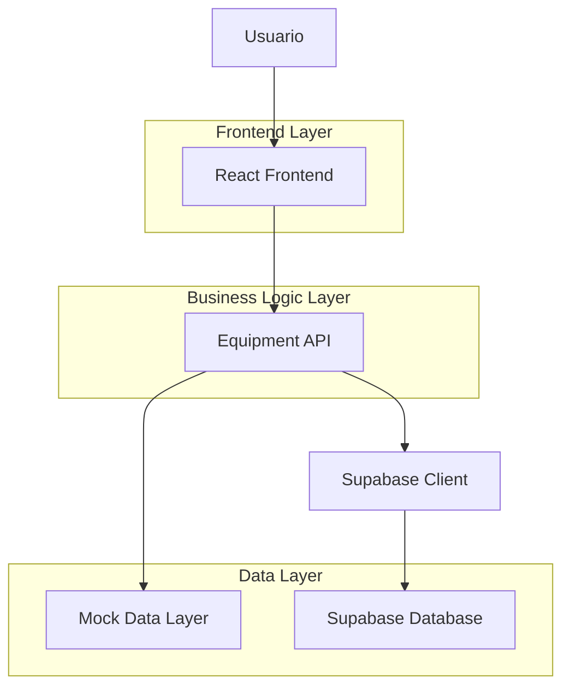
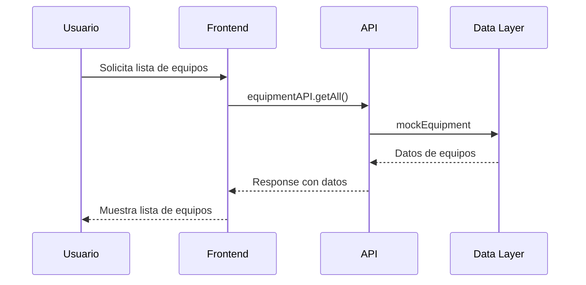
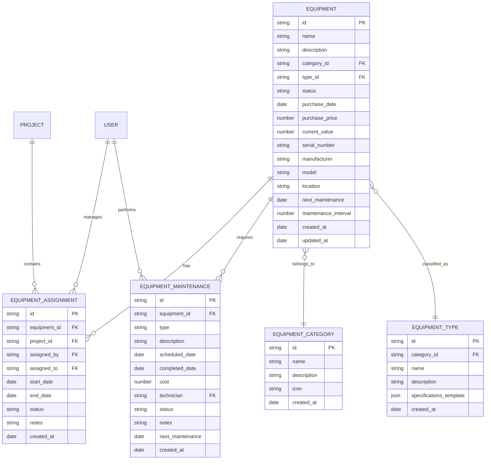
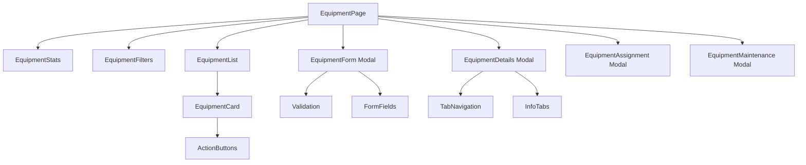

# Arquitectura Técnica del Módulo de Equipos - ConstructPro

## 1. Arquitectura General

### 1.1 Diagrama de Arquitectura


### 1.2 Flujo de Datos


## 2. Stack Tecnológico

### 2.1 Frontend
- **Framework**: React 18.2.0
- **Lenguaje**: TypeScript 5.0+
- **Build Tool**: Vite 4.0+
- **Estilos**: Tailwind CSS 3.0+
- **Icons**: Lucide React 0.263.1
- **Routing**: React Router DOM 6.8+

### 2.2 Backend (Actualmente Mock)
- **Simulación**: Datos mock en memoria
- **Migración futura**: Supabase PostgreSQL
- **API**: Funciones asíncronas con delay simulado

### 2.3 Dependencias Principales
```json
{
  "react": "^18.2.0",
  "react-dom": "^18.2.0",
  "react-router-dom": "^6.8.0",
  "lucide-react": "^0.263.1",
  "tailwindcss": "^3.0.0",
  "typescript": "^5.0.0",
  "vite": "^4.0.0"
}
```

## 3. Definición de Rutas

### 3.1 Rutas de Navegación
| Ruta | Componente | Propósito |
|------|------------|-----------|
| `/equipment` | EquipmentPage | Página principal del módulo |
| `/equipment/new` | EquipmentForm | Crear nuevo equipo |
| `/equipment/:id` | EquipmentDetails | Ver detalles del equipo |
| `/equipment/:id/edit` | EquipmentForm | Editar equipo existente |
| `/equipment/:id/assign` | EquipmentAssignment | Asignar equipo a proyecto |
| `/equipment/:id/maintenance` | EquipmentMaintenance | Gestionar mantenimiento |

### 3.2 Rutas de API (Mock)
| Endpoint | Método | Propósito |
|----------|--------|-----------|
| `/api/equipment` | GET | Obtener todos los equipos |
| `/api/equipment/:id` | GET | Obtener equipo por ID |
| `/api/equipment` | POST | Crear nuevo equipo |
| `/api/equipment/:id` | PUT | Actualizar equipo |
| `/api/equipment/:id` | DELETE | Eliminar equipo |
| `/api/equipment/:id/assign` | POST | Asignar equipo |
| `/api/equipment/:id/unassign` | POST | Desasignar equipo |
| `/api/equipment/:id/maintenance` | GET | Obtener historial de mantenimiento |
| `/api/equipment/:id/maintenance` | POST | Programar mantenimiento |

## 4. Modelo de Datos

### 4.1 Diagrama Entidad-Relación


### 4.2 Definiciones TypeScript
```typescript
// Tipos principales
export interface Equipment {
  id: string;
  name: string;
  description: string;
  category: EquipmentCategory;
  type: EquipmentType;
  status: EquipmentStatus;
  purchaseDate: string;
  purchasePrice: number;
  currentValue: number;
  serialNumber: string;
  manufacturer: string;
  model: string;
  specifications: Record<string, any>;
  location: string;
  assignedTo?: string;
  nextMaintenance?: string;
  maintenanceInterval: number;
  images?: string[];
  documents?: string[];
  createdAt: string;
  updatedAt: string;
}

export interface EquipmentAssignment {
  id: string;
  equipmentId: string;
  projectId: string;
  assignedBy: string;
  assignedTo: string;
  startDate: string;
  endDate?: string;
  status: AssignmentStatus;
  notes?: string;
  createdAt: string;
}

export interface EquipmentMaintenance {
  id: string;
  equipmentId: string;
  type: MaintenanceType;
  description: string;
  scheduledDate: string;
  completedDate?: string;
  cost: number;
  technician: string;
  status: MaintenanceStatus;
  notes?: string;
  documents?: string[];
  nextMaintenance?: string;
  createdAt: string;
}

// Enumeraciones
export enum EquipmentStatus {
  AVAILABLE = 'Disponible',
  IN_USE = 'En Uso',
  IN_MAINTENANCE = 'En Mantenimiento',
  RETIRED = 'Retirado',
  DAMAGED = 'Dañado'
}

export enum MaintenanceType {
  PREVENTIVE = 'Preventivo',
  CORRECTIVE = 'Correctivo',
  PREDICTIVE = 'Predictivo',
  EMERGENCY = 'Emergencia'
}

export enum AssignmentStatus {
  ACTIVE = 'Activo',
  COMPLETED = 'Completado',
  CANCELLED = 'Cancelado'
}
```

## 5. Arquitectura de Componentes

### 5.1 Estructura de Componentes


### 5.2 Componentes Principales

#### EquipmentPage (Container)
- **Responsabilidad**: Coordinar el módulo completo
- **Estado**: Lista de equipos, filtros, modales
- **Hooks**: useState, useEffect, useCallback
- **Eventos**: CRUD operations, filtrado, ordenamiento

#### EquipmentList (Presentational)
- **Responsabilidad**: Mostrar lista de equipos
- **Props**: equipments, onEdit, onDelete, onAssign
- **Responsive**: Tabla desktop, cards móvil
- **Features**: Paginación, ordenamiento, acciones

#### EquipmentForm (Form)
- **Responsabilidad**: Crear/editar equipos
- **Estado**: Form data, validation errors, loading
- **Validación**: Campos requeridos, formatos, rangos
- **Features**: Auto-save, validación en tiempo real

#### EquipmentDetails (Modal)
- **Responsabilidad**: Mostrar información detallada
- **Tabs**: General, Especificaciones, Asignaciones, Mantenimiento
- **Features**: Imágenes, documentos, historial
- **Actions**: Editar, asignar, mantenimiento

## 6. Estado de la Aplicación

### 6.1 Estado Local por Componente
```typescript
// EquipmentPage State
interface EquipmentPageState {
  equipments: Equipment[];
  loading: boolean;
  error: string | null;
  searchTerm: string;
  statusFilter: EquipmentStatus | 'all';
  categoryFilter: string | 'all';
  typeFilter: string | 'all';
  sortBy: string;
  sortOrder: 'asc' | 'desc';
  currentPage: number;
  itemsPerPage: number;
  selectedEquipment: Equipment | null;
  modalState: {
    form: boolean;
    details: boolean;
    assignment: boolean;
    maintenance: boolean;
  };
}

// EquipmentForm State
interface EquipmentFormState {
  formData: Partial<Equipment>;
  errors: Record<string, string>;
  loading: boolean;
  categories: EquipmentCategory[];
  types: EquipmentType[];
}
```

### 6.2 Gestión de Estado
- **Local State**: useState para estado de componentes
- **Side Effects**: useEffect para API calls
- **Callbacks**: useCallback para optimización
- **Memoization**: useMemo para cálculos pesados

## 7. API Layer

### 7.1 EquipmentAPI Implementation
```typescript
export const equipmentAPI = {
  // CRUD Operations
  async getAll(filters?: EquipmentFilters): Promise<Equipment[]> {
    await delay(500); // Simular network delay
    let results = mockEquipment;
    
    // Apply filters
    if (filters?.status && filters.status !== 'all') {
      results = results.filter(eq => eq.status === filters.status);
    }
    if (filters?.category && filters.category !== 'all') {
      results = results.filter(eq => eq.category === filters.category);
    }
    if (filters?.searchTerm) {
      const search = filters.searchTerm.toLowerCase();
      results = results.filter(eq => 
        eq.name.toLowerCase().includes(search) ||
        eq.description.toLowerCase().includes(search)
      );
    }
    
    return results;
  },

  async getById(id: string): Promise<Equipment | null> {
    await delay(300);
    return mockEquipment.find(eq => eq.id === id) || null;
  },

  async create(equipment: Partial<Equipment>): Promise<Equipment> {
    await delay(400);
    const newEquipment: Equipment = {
      id: `equip-${Date.now()}`,
      name: equipment.name || '',
      description: equipment.description || '',
      category: equipment.category || EquipmentCategory.HEAVY_MACHINERY,
      type: equipment.type || EquipmentType.EXCAVATOR,
      status: EquipmentStatus.AVAILABLE,
      purchaseDate: equipment.purchaseDate || new Date().toISOString(),
      purchasePrice: equipment.purchasePrice || 0,
      currentValue: equipment.currentValue || equipment.purchasePrice || 0,
      serialNumber: equipment.serialNumber || '',
      manufacturer: equipment.manufacturer || '',
      model: equipment.model || '',
      specifications: equipment.specifications || {},
      location: equipment.location || '',
      maintenanceInterval: equipment.maintenanceInterval || 30,
      createdAt: new Date().toISOString(),
      updatedAt: new Date().toISOString()
    };
    
    mockEquipment.push(newEquipment);
    return newEquipment;
  }
};
```

### 7.2 Error Handling
```typescript
class EquipmentAPIError extends Error {
  constructor(
    message: string,
    public code: string,
    public statusCode: number = 500
  ) {
    super(message);
    this.name = 'EquipmentAPIError';
  }
}

// Error handling in API methods
async getById(id: string): Promise<Equipment | null> {
  try {
    await delay(300);
    const equipment = mockEquipment.find(eq => eq.id === id);
    
    if (!equipment) {
      throw new EquipmentAPIError(
        'Equipment not found',
        'EQUIPMENT_NOT_FOUND',
        404
      );
    }
    
    return equipment;
  } catch (error) {
    if (error instanceof EquipmentAPIError) {
      throw error;
    }
    
    throw new EquipmentAPIError(
      'Failed to fetch equipment',
      'FETCH_ERROR',
      500
    );
  }
}
```

## 8. Testing Strategy

### 8.1 Unit Tests
```typescript
// Example unit test for EquipmentAPI
describe('equipmentAPI', () => {
  describe('getAll', () => {
    it('should return all equipment without filters', async () => {
      const result = await equipmentAPI.getAll();
      expect(result).toHaveLength(mockEquipment.length);
    });

    it('should filter by status', async () => {
      const result = await equipmentAPI.getAll({ 
        status: EquipmentStatus.AVAILABLE 
      });
      expect(result.every(eq => eq.status === EquipmentStatus.AVAILABLE)).toBe(true);
    });

    it('should filter by search term', async () => {
      const result = await equipmentAPI.getAll({ 
        searchTerm: 'Excavator' 
      });
      expect(result.every(eq => 
        eq.name.toLowerCase().includes('excavator') ||
        eq.description.toLowerCase().includes('excavator')
      )).toBe(true);
    });
  });
});
```

### 8.2 Integration Tests
- Testing de componentes con React Testing Library
- Testing de flujos completos del usuario
- Testing de integración con APIs

### 8.3 E2E Tests
- Flujos críticos con Cypress
- Testing de responsive design
- Testing de accesibilidad

## 9. Performance Optimization

### 9.1 Code Splitting
```typescript
// Lazy loading de componentes pesados
const EquipmentDetails = lazy(() => 
  import('./components/equipment/EquipmentDetails')
);

const EquipmentMaintenance = lazy(() => 
  import('./components/equipment/EquipmentMaintenance')
);
```

### 9.2 Memoization
```typescript
// Memoización de componentes costosos
const EquipmentList = memo(({ equipments, onEdit, onDelete }: EquipmentListProps) => {
  // Component implementation
}, (prevProps, nextProps) => {
  // Custom comparison function
  return prevProps.equipments === nextProps.equipments &&
         prevProps.onEdit === nextProps.onEdit &&
         prevProps.onDelete === nextProps.onDelete;
});
```

### 9.3 Virtualization
```typescript
// Virtualización de listas largas
import { FixedSizeList } from 'react-window';

const VirtualizedEquipmentList = ({ equipments }: { equipments: Equipment[] }) => {
  const Row = ({ index, style }: { index: number; style: React.CSSProperties }) => (
    <div style={style}>
      <EquipmentCard equipment={equipments[index]} />
    </div>
  );

  return (
    <FixedSizeList
      height={600}
      itemCount={equipments.length}
      itemSize={120}
      width="100%"
    >
      {Row}
    </FixedSizeList>
  );
};
```

## 10. Deployment Considerations

### 10.1 Environment Variables
```env
# Development
VITE_USE_MOCK_DATA=true
VITE_API_BASE_URL=http://localhost:3000

# Production
VITE_USE_MOCK_DATA=false
VITE_API_BASE_URL=https://api.constructpro.com
VITE_SUPABASE_URL=https://your-project.supabase.co
VITE_SUPABASE_ANON_KEY=your-anon-key
```

### 10.2 Build Configuration
```typescript
// vite.config.ts
import { defineConfig } from 'vite';
import react from '@vitejs/plugin-react';

export default defineConfig({
  plugins: [react()],
  build: {
    rollupOptions: {
      output: {
        manualChunks: {
          'equipment-module': [
            './src/pages/EquipmentPage',
            './src/components/equipment'
          ],
          'vendor': ['react', 'react-dom', 'react-router-dom']
        }
      }
    }
  }
});
```

### 10.3 Monitoring
```typescript
// Error tracking and monitoring
interface ErrorBoundaryState {
  hasError: boolean;
  error: Error | null;
  errorInfo: ErrorInfo | null;
}

class EquipmentErrorBoundary extends Component<Props, ErrorBoundaryState> {
  componentDidCatch(error: Error, errorInfo: ErrorInfo) {
    // Log to monitoring service
    console.error('Equipment module error:', error, errorInfo);
    
    // Send to error tracking service
    if (window.Sentry) {
      window.Sentry.captureException(error, {
        contexts: {
          react: {
            componentStack: errorInfo.componentStack
          }
        }
      });
    }
  }
}
```

---

**Nota**: Esta arquitectura está diseñada para ser escalable y mantenible. La capa de datos mock puede ser fácil