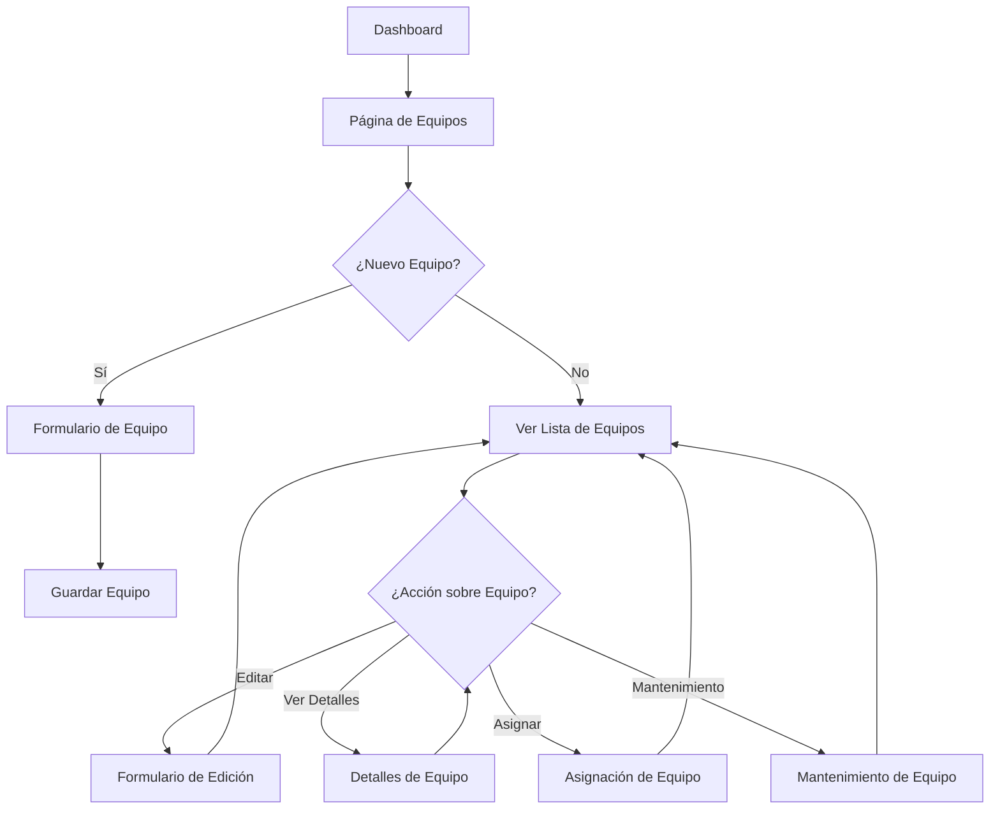
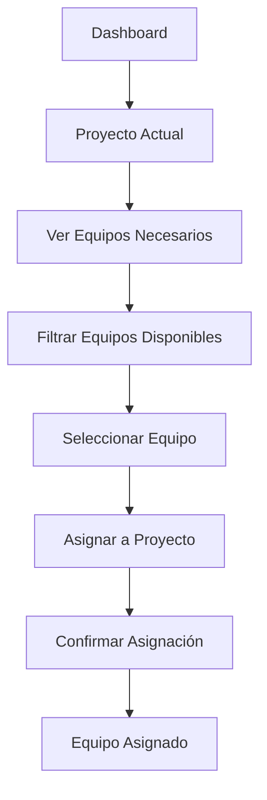
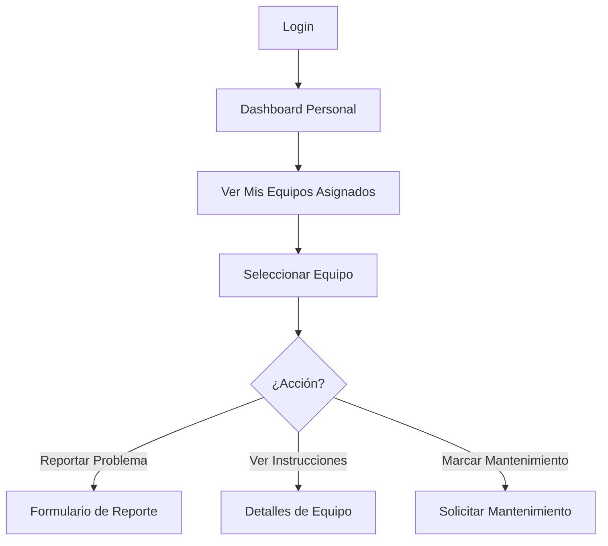

# Product Requirements Document (PRD) - Módulo de Gestión de Equipos

## 1. Visión General del Producto

ConstructPro es una plataforma integral de gestión de proyectos de construcción que permite a empresas constructoras administrar eficientemente sus proyectos, presupuestos, equipos y recursos humanos desde una única interfaz centralizada.

El **Módulo de Gestión de Equipos** es una extensión crítica de ConstructPro que aborda el problema común de la falta de visibilidad y control sobre el inventario de equipos, maquinaria y herramientas en proyectos de construcción. Este módulo permite a las empresas optimizar el uso de sus activos, reducir costos operativos y mejorar la productividad mediante una gestión inteligente de equipos.

### Problemas a Resolver
- **Falta de visibilidad**: Las empresas no tienen una visión clara de qué equipos están disponibles, en uso o en mantenimiento
- **Gestión manual ineficiente**: Los procesos de asignación de equipos se realizan manualmente, generando errores y retrasos
- **Mantenimiento reactivo**: No hay control preventivo del mantenimiento, llevando a fallos costosos
- **Pérdida de equipos**: Falta de trazabilidad sobre la ubicación y uso de equipos valiosos
- **Decisiones sin datos**: No hay análisis de utilización para optimizar inversiones en equipos

### Usuarios Objetivo
- **Gerentes de Proyecto**: Responsables de asignar equipos a proyectos específicos
- **Administradores de Equipo**: Encargados del inventario general y mantenimiento
- **Operadores de Equipo**: Personal que usa el equipo día a día
- **Directores de Operaciones**: Que necesitan visibilidad del rendimiento de activos

## 2. Características Principales

### 2.1 Roles de Usuario

| Rol | Método de Registro | Permisos Principales |
|-----|-------------------|---------------------|
| Administrador de Equipo | Asignado por superadmin | CRUD completo de equipos, gestión de mantenimiento, reportes |
| Gerente de Proyecto | Upgrade desde usuario normal | Asignar/desasignar equipos, ver disponibilidad, reportar problemas |
| Operador de Equipo | Registro estándar | Ver equipos asignados, reportar mantenimiento necesario |
| Supervisor de Obra | Registro estándar | Ver equipos en obra, solicitar equipos adicionales |

### 2.2 Módulos de la Aplicación

El módulo de equipos consta de las siguientes páginas principales:

1. **Página de Equipos**: Vista general con estadísticas, filtros avanzados y lista completa de equipos
2. **Formulario de Equipos**: Creación y edición de equipos con validaciones en tiempo real
3. **Detalles de Equipo**: Vista detallada con información completa, historial y acciones
4. **Asignación de Equipos**: Interfaz para asignar equipos a proyectos y gestionar asignaciones activas
5. **Mantenimiento de Equipos**: Programación, registro y seguimiento de mantenimientos

### 2.3 Detalles de Funcionalidades por Página

#### Página de Equipos
| Módulo | Funcionalidad | Descripción |
|--------|---------------|-------------|
| Estadísticas | Tarjetas de métricas | Mostrar total, disponibles, en uso, en mantenimiento, valor total y tasa de utilización |
| Filtros | Búsqueda por texto | Buscar por nombre, descripción, número de serie o ID |
| Filtros | Filtro por estado | Filtrar por disponible, en uso, en mantenimiento, retirado |
| Filtros | Filtro por categoría | Filtrar por maquinaria pesada, herramientas, vehículos, etc. |
| Filtros | Filtro por tipo | Filtrar por subtipos específicos (excavadoras, taladros, etc.) |
| Lista de Equipos | Vista de tabla/cards | Mostrar equipos con información clave y acciones rápidas |
| Lista de Equipos | Acciones por equipo | Ver detalles, editar, asignar, programar mantenimiento, eliminar |
| Lista de Equipos | Paginación | Navegación por páginas con selector de items por página |

#### Formulario de Equipos
| Módulo | Funcionalidad | Descripción |
|--------|---------------|-------------|
| Información Básica | Nombre y descripción | Campos de texto con validación de longitud |
| Información Básica | Categoría y tipo | Selectores dinámicos con opciones predefinidas |
| Información Básica | Estado del equipo | Selector de estado con validación de transiciones |
| Datos Técnicos | Fabricante y modelo | Campos de texto para información del fabricante |
| Datos Técnicos | Número de serie | Campo único con validación de formato |
| Datos Técnicos | Especificaciones | Formulario dinámico según el tipo de equipo |
| Datos Comerciales | Fecha de compra | Selector de fecha con validación |
| Datos Comerciales | Precio de compra | Campo numérico con formato de moneda |
| Datos Comerciales | Valor actual | Campo calculado automáticamente con depreciación |
| Mantenimiento | Intervalo de mantenimiento | Número de días entre mantenimientos |
| Mantenimiento | Próximo mantenimiento | Fecha calculada automáticamente |
| Ubicación | Ubicación actual | Texto o selector de ubicaciones predefinidas |
| Multimedia | Imágenes del equipo | Carga de múltiples imágenes con preview |
| Multimedia | Documentos | Carga de manuales, facturas, certificados |

#### Detalles de Equipo
| Módulo | Funcionalidad | Descripción |
|--------|---------------|-------------|
| Información General | Datos principales | Nombre, categoría, tipo, estado, valor actual |
| Información General | Imágenes | Galería de imágenes del equipo |
| Especificaciones | Tabla técnica | Lista de todas las especificaciones técnicas |
| Asignaciones | Historial completo | Tabla cronológica de todas las asignaciones |
| Asignaciones | Asignación actual | Proyecto actual y responsable si está en uso |
| Mantenimiento | Próximos mantenimientos | Lista de mantenimientos programados |
| Mantenimiento | Historial de mantenimiento | Registro completo de mantenimientos pasados |
| Documentos | Archivos adjuntos | Lista de documentos con preview y descarga |

#### Asignación de Equipos
| Módulo | Funcionalidad | Descripción |
|--------|---------------|-------------|
| Información del Equipo | Datos del equipo | Nombre, categoría, estado actual |
| Asignación Actual | Vista si existe | Mostrar asignación activa con proyecto y fechas |
| Nueva Asignación | Selector de proyecto | Dropdown con proyectos activos |
| Nueva Asignación | Selector de responsable | Personal disponible del proyecto seleccionado |
| Nueva Asignación | Fecha de inicio | Selector de fecha con validación |
| Nueva Asignación | Fecha de fin estimada | Opcional con validación de rango |
| Nueva Asignación | Notas | Campo de texto para instrucciones especiales |
| Lista de Asignaciones | Historial | Tabla con todas las asignaciones pasadas |

#### Mantenimiento de Equipos
| Módulo | Funcionalidad | Descripción |
|--------|---------------|-------------|
| Alertas | Mantenimientos próximos | Tarjetas visuales con equipos que necesitan mantenimiento |
| Alertas | Mantenimientos vencidos | Alertas rojas para equipos con mantenimiento atrasado |
| Programar Mantenimiento | Tipo de mantenimiento | Preventivo, correctivo, predictivo, emergencia |
| Programar Mantenimiento | Descripción | Campo de texto detallado del trabajo a realizar |
| Programar Mantenimiento | Fecha programada | Selector de fecha y hora |
| Programar Mantenimiento | Técnico asignado | Responsable de realizar el mantenimiento |
| Programar Mantenimiento | Costo estimado | Campo numérico con validación |
| Historial de Mantenimiento | Tabla completa | Lista cronológica de todos los mantenimientos |
| Historial de Mantenimiento | Filtros | Por tipo, fecha, técnico, costo |
| Historial de Mantenimiento | Documentos | Adjuntar informes, fotos, facturas |

## 3. Flujos de Usuario Principales

### 3.1 Flujo de Administrador de Equipo

### 3.2 Flujo de Gerente de Proyecto

### 3.3 Flujo de Operador de Equipo

## 4. Diseño de Interfaz de Usuario

### 4.1 Estilo de Diseño General
- **Sistema de Diseño**: Basado en componentes reutilizables
- **Colores Primarios**: Azul profesional (#3b82f6) para acciones principales
- **Colores Secundarios**: Grises neutros para fondos y texto secundario
- **Colores de Estado**: 
  - Verde (#10b981) para disponible/completado
  - Amarillo (#f59e0b) para advertencias/mantenimiento
  - Rojo (#ef4444) para errores/no disponible
  - Azul (#3b82f6) para información/en progreso

### 4.2 Elementos de UI por Página

#### Página de Equipos
| Elemento | Estilo | Especificaciones |
|----------|--------|------------------|
| Header | Fondo blanco, sombra sutil | Título "Gestión de Equipos" con botón "Nuevo Equipo" |
| Stats Cards | Grid responsivo, colores de estado | 6 tarjetas con iconos de Lucide React |
| Filtros | Barra horizontal, bg-gray-50 | Inputs con bordes redondeados, placeholders claros |
| Tabla Desktop | Bordes sutiles, hover effects | Columnas: Nombre, Categoría, Estado, Valor, Acciones |
| Cards Móvil | Diseño de tarjeta apilada | Información prioritaria, botones de acción agrupados |
| Paginación | Centro de página, números y flechas | Estilo outline, página actual resaltada |

#### Formulario de Equipos
| Elemento | Estilo | Especificaciones |
|----------|--------|------------------|
| Modal | Overlay oscuro, modal centrado | Ancho máximo 2xl, scroll interno si necesario |
| Secciones | Acordeones colapsables | Títulos claros, iconos de sección |
| Inputs | Bordes redondeados, focus states | Labels flotantes, validación en tiempo real |
| Botones | Primario: azul, Secundario: gris | Ubicados fijo en parte inferior del modal |
| Validación | Mensajes de error en rojo | Bordes rojos en campos inválidos |

#### Detalles de Equipo
| Elemento | Estilo | Especificaciones |
|----------|--------|------------------|
| Header | Imagen de equipo con overlay | Nombre del equipo en grande, estado como badge |
| Tabs | Navegación horizontal | Indicador activo con línea azul |
| Contenido | Cards de información | Grid responsivo, iconos informativos |
| Galería | Grid de imágenes, lightbox | Thumbnails clickeables, navegación de imagen |
| Tablas | Estilo consistente con app | Ordenamiento por columnas, paginación si necesario |

### 4.3 Responsive Design
- **Mobile First**: Diseño optimizado para móviles primero
- **Breakpoints**: 
  - Mobile: < 640px
  - Tablet: 640px - 1024px  
  - Desktop: > 1024px
- **Adaptaciones**:
  - Tablas se convierten en cards en móvil
  - Formularios de una columna en móvil, múltiples en desktop
  - Modales full-screen en móvil, centrados en desktop
  - Menú de acciones se convierte en dropdown en móvil

### 4.4 Accesibilidad
- **WCAG 2.1 AA**: Cumplimiento de estándares de accesibilidad
- **Navegación por teclado**: Todos los elementos interactivos accesibles
- **Screen Readers**: Labels y ARIA labels apropiados
- **Contraste**: Ratio mínimo 4.5:1 para texto normal, 3:1 para texto grande
- **Estados de Focus**: Indicadores visibles claros

## 5. Requisitos Técnicos

### 5.1 Performance
- **Tiempo de carga inicial**: < 3 segundos
- **Tiempo de interacción**: < 100ms para acciones usuales
- **Tamaño de bundle**: < 500KB gzipped para el módulo
- **Solicitudes API**: Máximo 20 por página cargada
- **Lazy loading**: Componentes pesados cargados bajo demanda

### 5.2 Compatibilidad
- **Navegadores**: Chrome 90+, Firefox 88+, Safari 14+, Edge 90+
- **Dispositivos**: Desktop, tablet, móvil (iOS 12+, Android 8+)
- **Resoluciones**: Desde 320px hasta 4K
- **Conexión**: Funcional en 3G, optimizada para 4G/WiFi

### 5.3 Seguridad
- **Autenticación**: JWT tokens con refresh automático
- **Autorización**: Role-based access control (RBAC)
- **Validación**: Cliente y servidor
- **Sanitización**: Prevención de XSS en inputs de usuario
- **HTTPS**: Toda la comunicación debe ser encriptada

### 5.4 Calidad de Código
- **TypeScript**: Uso estricto de tipos
- **ESLint**: Configuración estándar de React/TypeScript
- **Prettier**: Formato consistente del código
- **Testing**: Mínimo 80% cobertura
- **Documentación**: JSDoc para funciones públicas

## 6. Métricas de Éxito

### 6.1 KPIs de Usuario
- **Tiempo promedio de asignación**: Reducir de 30 minutos a 5 minutos
- **Equipos en mantenimiento preventivo**: Aumentar de 40% a 80%
- **Tiempo de búsqueda de equipos**: Reducir de 10 minutos a 30 segundos
- **Equipos perdidos**: Reducir en 90% el número de equipos sin localizar

### 6.2 KPIs de Negocio
- **ROI del módulo**: Payback en menos de 6 meses
- **Reducción de costos**: 15% reducción en costos de equipos
- **Eficiencia operativa**: 25% aumento en utilización de equipos
- **Satisfacción del cliente**: NPS > 8 en usuarios del módulo

### 6.3 KPIs Técnicos
- **Uptime**: 99.9% disponibilidad
- **Performance**: Score de Lighthouse > 90
- **Error rate**: < 0.1% de requests con error
- **Time to market**: Lanzamiento en 8 semanas

## 7. Cronograma y Milestones

### Fase 1: Diseño y Arquitectura (Semana 1-2)
- [ ] Documentación técnica completa
- [ ] Diseños de UI/UX aprobados
- [ ] Arquitectura de datos definida
- [ ] Setup del proyecto y herramientas

### Fase 2: Desarrollo Core (Semana 3-6)
- [ ] Componentes base implementados
- [ ] APIs mock funcionando
- [ ] CRUD de equipos completo
- [ ] Sistema de filtros y búsqueda

### Fase 3: Funcionalidades Avanzadas (Semana 7-8)
- [ ] Asignación de equipos a proyectos
- [ ] Sistema de mantenimiento
- [ ] Reportes y estadísticas
- [ ] Integración con dashboard principal

### Fase 4: Testing y Optimización (Semana 9-10)
- [ ] Testing completo (unit, integration, E2E)
- [ ] Optimización de performance
- [ ] Corrección de bugs
- [ ] Documentación de usuario

### Fase 5: Deployment y Lanzamiento (Semana 11-12)
- [ ] Deployment a staging
- [ ] User acceptance testing
- [ ] Training de usuarios
- [ ] Deployment a producción
- [ ] Monitoreo post-lanzamiento

## 8. Riesgos y Mitigaciones

### 8.1 Riesgos Técnicos
| Riesgo | Probabilidad | Impacto | Mitigación |
|--------|-------------|---------|------------|
| Performance issues con muchos equipos | Media | Alto | Implementar virtualización y paginación desde el inicio |
| Complejidad en asignaciones concurrentes | Alta | Medio | Implementar locking optimista y validaciones |
| Integración compleja con sistema existente | Media | Alto | Diseñar APIs bien definidas y mantener retrocompatibilidad |

### 8.2 Riesgos de Negocio
| Riesgo | Probabilidad | Impacto | Mitigación |
|--------|-------------|---------|------------|
| Adopción lenta por usuarios | Alta | Alto | Programa de training intensivo y cambio gradual |
| Datos de equipos incompletos | Alta | Medio | Herramientas de importación masiva y validación |
| Requisitos cambiantes | Media | Medio | Metodología ágil y revisiones frecuentes |

## 9. Consideraciones Post-Lanzamiento

### 9.1 Mantenimiento
- Monitoreo continuo de performance y errores
- Actualizaciones mensuales de seguridad
- Bug fixes prioritarios en 24 horas
- Mejoras incrementales basadas en feedback

### 9.2 Escalabilidad
- Arquitectura preparada para 10x crecimiento
- Migración fácil de datos mock a producción
- APIs versionadas para cambios futuros
- Documentación técnica mantenida

### 9.3 Futuras Mejoras
- **Integración IoT**: Conectar equipos con sensores para monitoreo real
- **App Móvil**: Versión nativa para operadores de campo
- **IA Predictiva**: Predecir fallas antes de que ocurran
- **Marketplace**: Plataforma para alquilar equipos entre empresas

---

**Versión**: 1.0  
**Última Actualización**: Diciembre 2024  
**Autor**: Equipo de Producto ConstructPro  
**Estado**: Aprobado para desarrollo